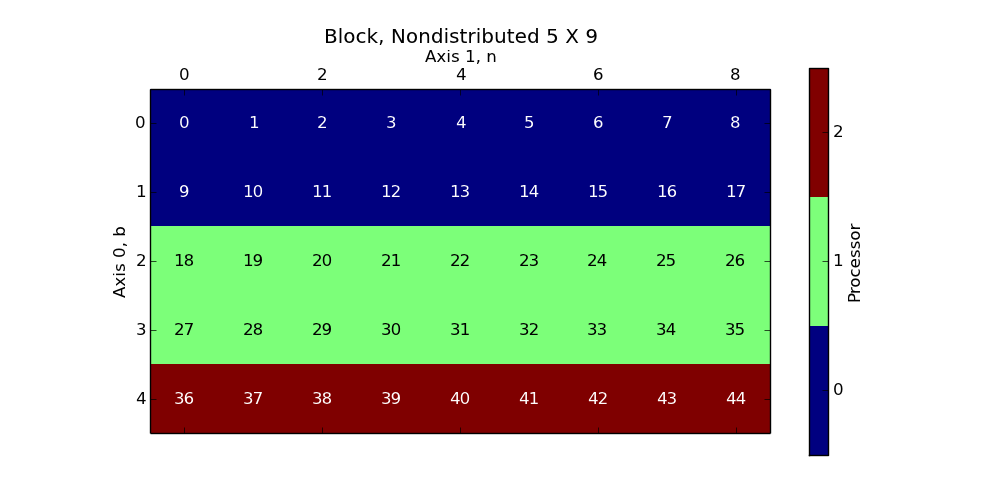
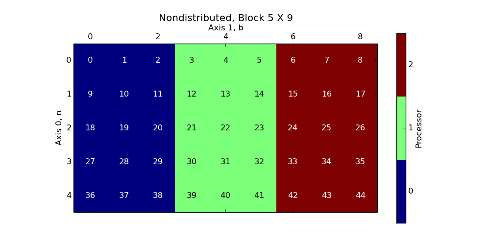
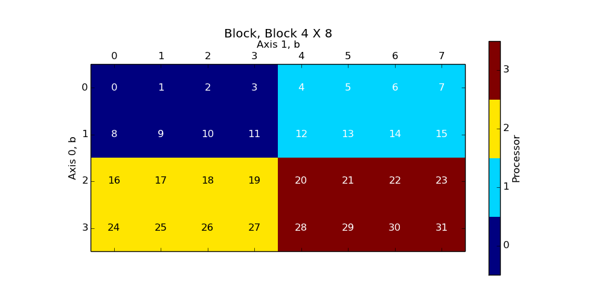
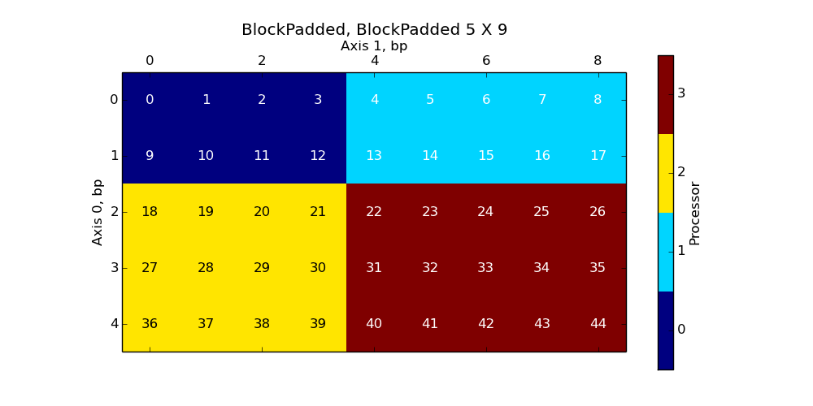

========
Examples
========


Block, Nondistributed
`````````````````````

A (5 X 9) array, with a Block, Nondistributed ('b' x 'n') distribution over a (4 X 1) process grid.



The full (undistributed) array:

>>> full_array
array([[  0.,   1.,   2.,   3.,   4.,   5.,   6.,   7.,   8.],
       [  9.,  10.,  11.,  12.,  13.,  14.,  15.,  16.,  17.],
       [ 18.,  19.,  20.,  21.,  22.,  23.,  24.,  25.,  26.],
       [ 27.,  28.,  29.,  30.,  31.,  32.,  33.,  34.,  35.],
       [ 36.,  37.,  38.,  39.,  40.,  41.,  42.,  43.,  44.]])

In all processes:

>>> distbuffer = local_array.__distarray__()
>>> distbuffer.keys()
['buffer', 'dim_data', '__version__']
>>> distbuffer['__version__']
'1.0.0'

In process 0:

>>> distbuffer['buffer']
array([[  0.,   1.,   2.,   3.,   4.,   5.,   6.,   7.,   8.],
       [  9.,  10.,  11.,  12.,  13.,  14.,  15.,  16.,  17.]])
>>> distbuffer['dim_data']
({'dist_type': 'b',
  'proc_grid_rank': 0,
  'proc_grid_size': 4,
  'size': 5,
  'start': 0,
  'stop': 2},
 {'dist_type': 'n', 'proc_grid_rank': 0, 'proc_grid_size': 1, 'size': 9})

In process 1:

>>> distbuffer['buffer']
array([[ 18.,  19.,  20.,  21.,  22.,  23.,  24.,  25.,  26.],
       [ 27.,  28.,  29.,  30.,  31.,  32.,  33.,  34.,  35.]])
>>> distbuffer['dim_data']
({'dist_type': 'b',
  'proc_grid_rank': 1,
  'proc_grid_size': 4,
  'size': 5,
  'start': 2,
  'stop': 4},
 {'dist_type': 'n', 'proc_grid_rank': 0, 'proc_grid_size': 1, 'size': 9})

In process 2:

>>> distbuffer['buffer']
array([[ 36.,  37.,  38.,  39.,  40.,  41.,  42.,  43.,  44.]])
>>> distbuffer['dim_data']
({'dist_type': 'b',
  'proc_grid_rank': 2,
  'proc_grid_size': 4,
  'size': 5,
  'start': 4,
  'stop': 5},
 {'dist_type': 'n', 'proc_grid_rank': 0, 'proc_grid_size': 1, 'size': 9})

In process 3:

>>> distbuffer['buffer']
array([], shape=(0, 9), dtype=float64)
>>> distbuffer['dim_data']
({'dist_type': 'b',
  'proc_grid_rank': 3,
  'proc_grid_size': 4,
  'size': 5,
  'start': 5,
  'stop': 5},
 {'dist_type': 'n', 'proc_grid_rank': 0, 'proc_grid_size': 1, 'size': 9})

Nondistributed, Block
`````````````````````

A (5 X 9) array, with a Nondistributed, Block ('n' x 'b') distribution over a (1 X 4) process grid.



The full (undistributed) array:

>>> full_array
array([[  0.,   1.,   2.,   3.,   4.,   5.,   6.,   7.,   8.],
       [  9.,  10.,  11.,  12.,  13.,  14.,  15.,  16.,  17.],
       [ 18.,  19.,  20.,  21.,  22.,  23.,  24.,  25.,  26.],
       [ 27.,  28.,  29.,  30.,  31.,  32.,  33.,  34.,  35.],
       [ 36.,  37.,  38.,  39.,  40.,  41.,  42.,  43.,  44.]])

In all processes:

>>> distbuffer = local_array.__distarray__()
>>> distbuffer.keys()
['buffer', 'dim_data', '__version__']
>>> distbuffer['__version__']
'1.0.0'

In process 0:

>>> distbuffer['buffer']
array([[  0.,   1.,   2.],
       [  9.,  10.,  11.],
       [ 18.,  19.,  20.],
       [ 27.,  28.,  29.],
       [ 36.,  37.,  38.]])
>>> distbuffer['dim_data']
({'dist_type': 'n', 'proc_grid_rank': 0, 'proc_grid_size': 1, 'size': 5},
 {'dist_type': 'b',
  'proc_grid_rank': 0,
  'proc_grid_size': 4,
  'size': 9,
  'start': 0,
  'stop': 3})

In process 1:

>>> distbuffer['buffer']
array([[  3.,   4.,   5.],
       [ 12.,  13.,  14.],
       [ 21.,  22.,  23.],
       [ 30.,  31.,  32.],
       [ 39.,  40.,  41.]])
>>> distbuffer['dim_data']
({'dist_type': 'n', 'proc_grid_rank': 0, 'proc_grid_size': 1, 'size': 5},
 {'dist_type': 'b',
  'proc_grid_rank': 1,
  'proc_grid_size': 4,
  'size': 9,
  'start': 3,
  'stop': 6})

In process 2:

>>> distbuffer['buffer']
array([[  6.,   7.,   8.],
       [ 15.,  16.,  17.],
       [ 24.,  25.,  26.],
       [ 33.,  34.,  35.],
       [ 42.,  43.,  44.]])
>>> distbuffer['dim_data']
({'dist_type': 'n', 'proc_grid_rank': 0, 'proc_grid_size': 1, 'size': 5},
 {'dist_type': 'b',
  'proc_grid_rank': 2,
  'proc_grid_size': 4,
  'size': 9,
  'start': 6,
  'stop': 9})

In process 3:

>>> distbuffer['buffer']
array([], shape=(5, 0), dtype=float64)
>>> distbuffer['dim_data']
({'dist_type': 'n', 'proc_grid_rank': 0, 'proc_grid_size': 1, 'size': 5},
 {'dist_type': 'b',
  'proc_grid_rank': 3,
  'proc_grid_size': 4,
  'size': 9,
  'start': 9,
  'stop': 9})

Block, Block
````````````

A (5 X 9) array, with a Block, Block ('b' x 'b') distribution over a (2 X 2) process grid.



The full (undistributed) array:

>>> full_array
array([[  0.,   1.,   2.,   3.,   4.,   5.,   6.,   7.,   8.],
       [  9.,  10.,  11.,  12.,  13.,  14.,  15.,  16.,  17.],
       [ 18.,  19.,  20.,  21.,  22.,  23.,  24.,  25.,  26.],
       [ 27.,  28.,  29.,  30.,  31.,  32.,  33.,  34.,  35.],
       [ 36.,  37.,  38.,  39.,  40.,  41.,  42.,  43.,  44.]])

In all processes:

>>> distbuffer = local_array.__distarray__()
>>> distbuffer.keys()
['buffer', 'dim_data', '__version__']
>>> distbuffer['__version__']
'1.0.0'

In process 0:

>>> distbuffer['buffer']
array([[  0.,   1.,   2.,   3.,   4.],
       [  9.,  10.,  11.,  12.,  13.],
       [ 18.,  19.,  20.,  21.,  22.]])
>>> distbuffer['dim_data']
({'dist_type': 'b',
  'proc_grid_rank': 0,
  'proc_grid_size': 2,
  'size': 5,
  'start': 0,
  'stop': 3},
 {'dist_type': 'b',
  'proc_grid_rank': 0,
  'proc_grid_size': 2,
  'size': 9,
  'start': 0,
  'stop': 5})

In process 1:

>>> distbuffer['buffer']
array([[  5.,   6.,   7.,   8.],
       [ 14.,  15.,  16.,  17.],
       [ 23.,  24.,  25.,  26.]])
>>> distbuffer['dim_data']
({'dist_type': 'b',
  'proc_grid_rank': 0,
  'proc_grid_size': 2,
  'size': 5,
  'start': 0,
  'stop': 3},
 {'dist_type': 'b',
  'proc_grid_rank': 1,
  'proc_grid_size': 2,
  'size': 9,
  'start': 5,
  'stop': 9})

In process 2:

>>> distbuffer['buffer']
array([[ 27.,  28.,  29.,  30.,  31.],
       [ 36.,  37.,  38.,  39.,  40.]])
>>> distbuffer['dim_data']
({'dist_type': 'b',
  'proc_grid_rank': 1,
  'proc_grid_size': 2,
  'size': 5,
  'start': 3,
  'stop': 5},
 {'dist_type': 'b',
  'proc_grid_rank': 0,
  'proc_grid_size': 2,
  'size': 9,
  'start': 0,
  'stop': 5})

In process 3:

>>> distbuffer['buffer']
array([[ 32.,  33.,  34.,  35.],
       [ 41.,  42.,  43.,  44.]])
>>> distbuffer['dim_data']
({'dist_type': 'b',
  'proc_grid_rank': 1,
  'proc_grid_size': 2,
  'size': 5,
  'start': 3,
  'stop': 5},
 {'dist_type': 'b',
  'proc_grid_rank': 1,
  'proc_grid_size': 2,
  'size': 9,
  'start': 5,
  'stop': 9})

Block, Cyclic
`````````````

A (5 X 9) array, with a Block, Cyclic ('b' x 'c') distribution over a (2 X 2) process grid.

.. image:: images/plot_block_cyclic.png

The full (undistributed) array:

>>> full_array
array([[  0.,   1.,   2.,   3.,   4.,   5.,   6.,   7.,   8.],
       [  9.,  10.,  11.,  12.,  13.,  14.,  15.,  16.,  17.],
       [ 18.,  19.,  20.,  21.,  22.,  23.,  24.,  25.,  26.],
       [ 27.,  28.,  29.,  30.,  31.,  32.,  33.,  34.,  35.],
       [ 36.,  37.,  38.,  39.,  40.,  41.,  42.,  43.,  44.]])

In all processes:

>>> distbuffer = local_array.__distarray__()
>>> distbuffer.keys()
['buffer', 'dim_data', '__version__']
>>> distbuffer['__version__']
'1.0.0'

In process 0:

>>> distbuffer['buffer']
array([[  0.,   2.,   4.,   6.,   8.],
       [  9.,  11.,  13.,  15.,  17.],
       [ 18.,  20.,  22.,  24.,  26.]])
>>> distbuffer['dim_data']
({'dist_type': 'b',
  'proc_grid_rank': 0,
  'proc_grid_size': 2,
  'size': 5,
  'start': 0,
  'stop': 3},
 {'block_size': 1,
  'dist_type': 'c',
  'proc_grid_rank': 0,
  'proc_grid_size': 2,
  'size': 9,
  'start': 0})

In process 1:

>>> distbuffer['buffer']
array([[  1.,   3.,   5.,   7.],
       [ 10.,  12.,  14.,  16.],
       [ 19.,  21.,  23.,  25.]])
>>> distbuffer['dim_data']
({'dist_type': 'b',
  'proc_grid_rank': 0,
  'proc_grid_size': 2,
  'size': 5,
  'start': 0,
  'stop': 3},
 {'block_size': 1,
  'dist_type': 'c',
  'proc_grid_rank': 1,
  'proc_grid_size': 2,
  'size': 9,
  'start': 1})

In process 2:

>>> distbuffer['buffer']
array([[ 27.,  29.,  31.,  33.,  35.],
       [ 36.,  38.,  40.,  42.,  44.]])
>>> distbuffer['dim_data']
({'dist_type': 'b',
  'proc_grid_rank': 1,
  'proc_grid_size': 2,
  'size': 5,
  'start': 3,
  'stop': 5},
 {'block_size': 1,
  'dist_type': 'c',
  'proc_grid_rank': 0,
  'proc_grid_size': 2,
  'size': 9,
  'start': 0})

In process 3:

>>> distbuffer['buffer']
array([[ 28.,  30.,  32.,  34.],
       [ 37.,  39.,  41.,  43.]])
>>> distbuffer['dim_data']
({'dist_type': 'b',
  'proc_grid_rank': 1,
  'proc_grid_size': 2,
  'size': 5,
  'start': 3,
  'stop': 5},
 {'block_size': 1,
  'dist_type': 'c',
  'proc_grid_rank': 1,
  'proc_grid_size': 2,
  'size': 9,
  'start': 1})

Cyclic, Cyclic
``````````````

A (5 X 9) array, with a Cyclic, Cyclic ('c' x 'c') distribution over a (2 X 2) process grid.

.. image:: images/plot_cyclic_cyclic.png

The full (undistributed) array:

>>> full_array
array([[  0.,   1.,   2.,   3.,   4.,   5.,   6.,   7.,   8.],
       [  9.,  10.,  11.,  12.,  13.,  14.,  15.,  16.,  17.],
       [ 18.,  19.,  20.,  21.,  22.,  23.,  24.,  25.,  26.],
       [ 27.,  28.,  29.,  30.,  31.,  32.,  33.,  34.,  35.],
       [ 36.,  37.,  38.,  39.,  40.,  41.,  42.,  43.,  44.]])

In all processes:

>>> distbuffer = local_array.__distarray__()
>>> distbuffer.keys()
['buffer', 'dim_data', '__version__']
>>> distbuffer['__version__']
'1.0.0'

In process 0:

>>> distbuffer['buffer']
array([[  0.,   2.,   4.,   6.,   8.],
       [ 18.,  20.,  22.,  24.,  26.],
       [ 36.,  38.,  40.,  42.,  44.]])
>>> distbuffer['dim_data']
({'block_size': 1,
  'dist_type': 'c',
  'proc_grid_rank': 0,
  'proc_grid_size': 2,
  'size': 5,
  'start': 0},
 {'block_size': 1,
  'dist_type': 'c',
  'proc_grid_rank': 0,
  'proc_grid_size': 2,
  'size': 9,
  'start': 0})

In process 1:

>>> distbuffer['buffer']
array([[  1.,   3.,   5.,   7.],
       [ 19.,  21.,  23.,  25.],
       [ 37.,  39.,  41.,  43.]])
>>> distbuffer['dim_data']
({'block_size': 1,
  'dist_type': 'c',
  'proc_grid_rank': 0,
  'proc_grid_size': 2,
  'size': 5,
  'start': 0},
 {'block_size': 1,
  'dist_type': 'c',
  'proc_grid_rank': 1,
  'proc_grid_size': 2,
  'size': 9,
  'start': 1})

In process 2:

>>> distbuffer['buffer']
array([[  9.,  11.,  13.,  15.,  17.],
       [ 27.,  29.,  31.,  33.,  35.]])
>>> distbuffer['dim_data']
({'block_size': 1,
  'dist_type': 'c',
  'proc_grid_rank': 1,
  'proc_grid_size': 2,
  'size': 5,
  'start': 1},
 {'block_size': 1,
  'dist_type': 'c',
  'proc_grid_rank': 0,
  'proc_grid_size': 2,
  'size': 9,
  'start': 0})

In process 3:

>>> distbuffer['buffer']
array([[ 10.,  12.,  14.,  16.],
       [ 28.,  30.,  32.,  34.]])
>>> distbuffer['dim_data']
({'block_size': 1,
  'dist_type': 'c',
  'proc_grid_rank': 1,
  'proc_grid_size': 2,
  'size': 5,
  'start': 1},
 {'block_size': 1,
  'dist_type': 'c',
  'proc_grid_rank': 1,
  'proc_grid_size': 2,
  'size': 9,
  'start': 1})

BlockCyclic, BlockCyclic
````````````````````````

A (5 X 9) array, with a BlockCyclic, BlockCyclic ('bc' x 'bc') distribution over a (2 X 2) process grid.

.. image:: images/plot_blockcyclic_blockcyclic.png

The full (undistributed) array:

>>> full_array
array([[  0.,   1.,   2.,   3.,   4.,   5.,   6.,   7.,   8.],
       [  9.,  10.,  11.,  12.,  13.,  14.,  15.,  16.,  17.],
       [ 18.,  19.,  20.,  21.,  22.,  23.,  24.,  25.,  26.],
       [ 27.,  28.,  29.,  30.,  31.,  32.,  33.,  34.,  35.],
       [ 36.,  37.,  38.,  39.,  40.,  41.,  42.,  43.,  44.]])

In all processes:

>>> distbuffer = local_array.__distarray__()
>>> distbuffer.keys()
['buffer', 'dim_data', '__version__']
>>> distbuffer['__version__']
'1.0.0'

In process 0:

>>> distbuffer['buffer']
array([[  0.,   1.,   4.,   5.,   8.],
       [  9.,  10.,  13.,  14.,  17.],
       [ 36.,  37.,  40.,  41.,  44.]])
>>> distbuffer['dim_data']
({'block_size': 2,
  'dist_type': 'c',
  'proc_grid_rank': 0,
  'proc_grid_size': 2,
  'size': 5,
  'start': 0},
 {'block_size': 2,
  'dist_type': 'c',
  'proc_grid_rank': 0,
  'proc_grid_size': 2,
  'size': 9,
  'start': 0})

In process 1:

>>> distbuffer['buffer']
array([[  2.,   3.,   6.,   7.],
       [ 11.,  12.,  15.,  16.],
       [ 38.,  39.,  42.,  43.]])
>>> distbuffer['dim_data']
({'block_size': 2,
  'dist_type': 'c',
  'proc_grid_rank': 0,
  'proc_grid_size': 2,
  'size': 5,
  'start': 0},
 {'block_size': 2,
  'dist_type': 'c',
  'proc_grid_rank': 1,
  'proc_grid_size': 2,
  'size': 9,
  'start': 2})

In process 2:

>>> distbuffer['buffer']
array([[ 18.,  19.,  22.,  23.,  26.],
       [ 27.,  28.,  31.,  32.,  35.]])
>>> distbuffer['dim_data']
({'block_size': 2,
  'dist_type': 'c',
  'proc_grid_rank': 1,
  'proc_grid_size': 2,
  'size': 5,
  'start': 2},
 {'block_size': 2,
  'dist_type': 'c',
  'proc_grid_rank': 0,
  'proc_grid_size': 2,
  'size': 9,
  'start': 0})

In process 3:

>>> distbuffer['buffer']
array([[ 20.,  21.,  24.,  25.],
       [ 29.,  30.,  33.,  34.]])
>>> distbuffer['dim_data']
({'block_size': 2,
  'dist_type': 'c',
  'proc_grid_rank': 1,
  'proc_grid_size': 2,
  'size': 5,
  'start': 2},
 {'block_size': 2,
  'dist_type': 'c',
  'proc_grid_rank': 1,
  'proc_grid_size': 2,
  'size': 9,
  'start': 2})

BlockPadded, BlockPadded
````````````````````````

A (5 X 9) array, with a BlockPadded, BlockPadded ('bp' x 'bp') distribution over a (2 X 2) process grid.



The full (undistributed) array:

>>> full_array
array([[  0.,   1.,   2.,   3.,   4.,   5.,   6.,   7.,   8.],
       [  9.,  10.,  11.,  12.,  13.,  14.,  15.,  16.,  17.],
       [ 18.,  19.,  20.,  21.,  22.,  23.,  24.,  25.,  26.],
       [ 27.,  28.,  29.,  30.,  31.,  32.,  33.,  34.,  35.],
       [ 36.,  37.,  38.,  39.,  40.,  41.,  42.,  43.,  44.]])

In all processes:

>>> distbuffer = local_array.__distarray__()
>>> distbuffer.keys()
['buffer', 'dim_data', '__version__']
>>> distbuffer['__version__']
'1.0.0'

In process 0:

>>> distbuffer['buffer']
array([[  0.,   1.,   2.,   3.],
       [  9.,  10.,  11.,  12.]])
>>> distbuffer['dim_data']
({'dist_type': 'b',
  'padding': (1, 1),
  'proc_grid_rank': 0,
  'proc_grid_size': 2,
  'size': 5,
  'start': 0,
  'stop': 2},
 {'dist_type': 'b',
  'padding': (1, 1),
  'proc_grid_rank': 0,
  'proc_grid_size': 2,
  'size': 9,
  'start': 0,
  'stop': 4})

In process 1:

>>> distbuffer['buffer']
array([[  4.,   5.,   6.,   7.,   8.],
       [ 13.,  14.,  15.,  16.,  17.]])
>>> distbuffer['dim_data']
({'dist_type': 'b',
  'padding': (1, 1),
  'proc_grid_rank': 0,
  'proc_grid_size': 2,
  'size': 5,
  'start': 0,
  'stop': 2},
 {'dist_type': 'b',
  'padding': (1, 1),
  'proc_grid_rank': 1,
  'proc_grid_size': 2,
  'size': 9,
  'start': 4,
  'stop': 9})

In process 2:

>>> distbuffer['buffer']
array([[ 18.,  19.,  20.,  21.],
       [ 27.,  28.,  29.,  30.],
       [ 36.,  37.,  38.,  39.]])
>>> distbuffer['dim_data']
({'dist_type': 'b',
  'padding': (1, 1),
  'proc_grid_rank': 1,
  'proc_grid_size': 2,
  'size': 5,
  'start': 2,
  'stop': 5},
 {'dist_type': 'b',
  'padding': (1, 1),
  'proc_grid_rank': 0,
  'proc_grid_size': 2,
  'size': 9,
  'start': 0,
  'stop': 4})

In process 3:

>>> distbuffer['buffer']
array([[ 22.,  23.,  24.,  25.,  26.],
       [ 31.,  32.,  33.,  34.,  35.],
       [ 40.,  41.,  42.,  43.,  44.]])
>>> distbuffer['dim_data']
({'dist_type': 'b',
  'padding': (1, 1),
  'proc_grid_rank': 1,
  'proc_grid_size': 2,
  'size': 5,
  'start': 2,
  'stop': 5},
 {'dist_type': 'b',
  'padding': (1, 1),
  'proc_grid_rank': 1,
  'proc_grid_size': 2,
  'size': 9,
  'start': 4,
  'stop': 9})

Unstructured, Unstructured
``````````````````````````

A (5 X 9) array, with a Unstructured, Unstructured ('u' x 'u') distribution over a (2 X 2) process grid.

.. image:: images/plot_unstruct_unstruct.png

The full (undistributed) array:

>>> full_array
array([[  0.,   1.,   2.,   3.,   4.,   5.,   6.,   7.,   8.],
       [  9.,  10.,  11.,  12.,  13.,  14.,  15.,  16.,  17.],
       [ 18.,  19.,  20.,  21.,  22.,  23.,  24.,  25.,  26.],
       [ 27.,  28.,  29.,  30.,  31.,  32.,  33.,  34.,  35.],
       [ 36.,  37.,  38.,  39.,  40.,  41.,  42.,  43.,  44.]])

In all processes:

>>> distbuffer = local_array.__distarray__()
>>> distbuffer.keys()
['buffer', 'dim_data', '__version__']
>>> distbuffer['__version__']
'1.0.0'

In process 0:

>>> distbuffer['buffer']
array([[ 29.,  30.,  34.,  28.],
       [  2.,   3.,   7.,   1.]])
>>> distbuffer['dim_data']
({'dist_type': 'u',
  'indices': array([3, 0]),
  'proc_grid_rank': 0,
  'proc_grid_size': 2,
  'size': 5},
 {'dist_type': 'u',
  'indices': array([2, 3, 7, 1]),
  'proc_grid_rank': 0,
  'proc_grid_size': 2,
  'size': 9})

In process 1:

>>> distbuffer['buffer']
array([[ 33.,  32.,  35.,  27.,  31.],
       [  6.,   5.,   8.,   0.,   4.]])
>>> distbuffer['dim_data']
({'dist_type': 'u',
  'indices': array([3, 0]),
  'proc_grid_rank': 0,
  'proc_grid_size': 2,
  'size': 5},
 {'dist_type': 'u',
  'indices': array([6, 5, 8, 0, 4]),
  'proc_grid_rank': 1,
  'proc_grid_size': 2,
  'size': 9})

In process 2:

>>> distbuffer['buffer']
array([[ 38.,  39.,  43.,  37.],
       [ 20.,  21.,  25.,  19.],
       [ 11.,  12.,  16.,  10.]])
>>> distbuffer['dim_data']
({'dist_type': 'u',
  'indices': array([4, 2, 1]),
  'proc_grid_rank': 1,
  'proc_grid_size': 2,
  'size': 5},
 {'dist_type': 'u',
  'indices': array([2, 3, 7, 1]),
  'proc_grid_rank': 0,
  'proc_grid_size': 2,
  'size': 9})

In process 3:

>>> distbuffer['buffer']
array([[ 42.,  41.,  44.,  36.,  40.],
       [ 24.,  23.,  26.,  18.,  22.],
       [ 15.,  14.,  17.,   9.,  13.]])
>>> distbuffer['dim_data']
({'dist_type': 'u',
  'indices': array([4, 2, 1]),
  'proc_grid_rank': 1,
  'proc_grid_size': 2,
  'size': 5},
 {'dist_type': 'u',
  'indices': array([6, 5, 8, 0, 4]),
  'proc_grid_rank': 1,
  'proc_grid_size': 2,
  'size': 9})

