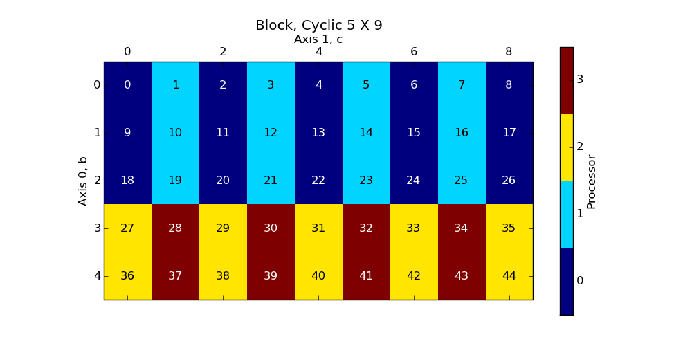
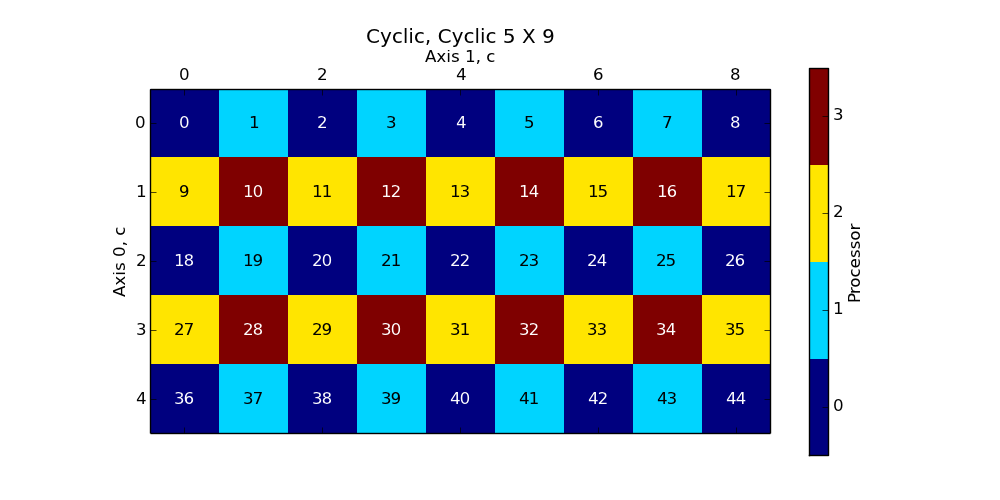
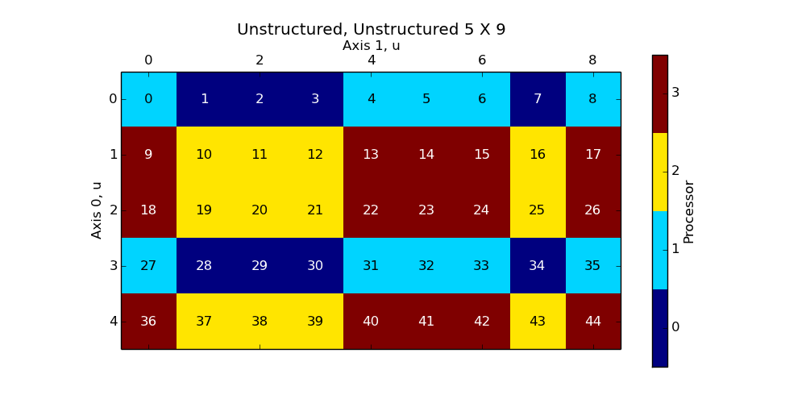

Block, Block
````````````

A (5 X 9) array, with a Block, Block ('b' x 'b') distribution over a (4 X 1) process grid.

.. image:: images/plot_block_block_4x1.png

The full (undistributed) array:

.. code-block:: python

    >>> full_array
    array([[  0.,   1.,   2.,   3.,   4.,   5.,   6.,   7.,   8.],
           [  9.,  10.,  11.,  12.,  13.,  14.,  15.,  16.,  17.],
           [ 18.,  19.,  20.,  21.,  22.,  23.,  24.,  25.,  26.],
           [ 27.,  28.,  29.,  30.,  31.,  32.,  33.,  34.,  35.],
           [ 36.,  37.,  38.,  39.,  40.,  41.,  42.,  43.,  44.]])

In all processes, we have:

.. code-block:: python

    >>> distbuffer = local_array.__distarray__()
    >>> distbuffer.keys()
    ['buffer', 'dim_data', '__version__']
    >>> distbuffer['__version__']
    '1.0.0'

The local arrays, on each separate engine:

.. image:: images/plot_block_block_4x1_local.png

+-------------------------------------------------------------------+
|In process (0, 0):                                                 |
|                                                                   |
|.. code-block:: python                                             |
|                                                                   |
|    >>> distbuffer['buffer']                                       |
|    array([[  0.,   1.,   2.,   3.,   4.,   5.,   6.,   7.,   8.], |
|           [  9.,  10.,  11.,  12.,  13.,  14.,  15.,  16.,  17.]])|
|    >>> distbuffer['dim_data']                                     |
|    ({'dist_type': 'b',                                            |
|      'padding': [0, 0],                                           |
|      'proc_grid_rank': 0,                                         |
|      'proc_grid_size': 4,                                         |
|      'size': 5,                                                   |
|      'start': 0,                                                  |
|      'stop': 2},                                                  |
|     {'dist_type': 'b',                                            |
|      'padding': [0, 0],                                           |
|      'proc_grid_rank': 0,                                         |
|      'proc_grid_size': 1,                                         |
|      'size': 9,                                                   |
|      'start': 0,                                                  |
|      'stop': 9})                                                  |
|                                                                   |
+-------------------------------------------------------------------+
|In process (1, 0):                                                 |
|                                                                   |
|.. code-block:: python                                             |
|                                                                   |
|    >>> distbuffer['buffer']                                       |
|    array([[ 18.,  19.,  20.,  21.,  22.,  23.,  24.,  25.,  26.], |
|           [ 27.,  28.,  29.,  30.,  31.,  32.,  33.,  34.,  35.]])|
|    >>> distbuffer['dim_data']                                     |
|    ({'dist_type': 'b',                                            |
|      'padding': [0, 0],                                           |
|      'proc_grid_rank': 1,                                         |
|      'proc_grid_size': 4,                                         |
|      'size': 5,                                                   |
|      'start': 2,                                                  |
|      'stop': 4},                                                  |
|     {'dist_type': 'b',                                            |
|      'padding': [0, 0],                                           |
|      'proc_grid_rank': 0,                                         |
|      'proc_grid_size': 1,                                         |
|      'size': 9,                                                   |
|      'start': 0,                                                  |
|      'stop': 9})                                                  |
|                                                                   |
+-------------------------------------------------------------------+
|In process (2, 0):                                                 |
|                                                                   |
|.. code-block:: python                                             |
|                                                                   |
|    >>> distbuffer['buffer']                                       |
|    array([[ 36.,  37.,  38.,  39.,  40.,  41.,  42.,  43.,  44.]])|
|    >>> distbuffer['dim_data']                                     |
|    ({'dist_type': 'b',                                            |
|      'padding': [0, 0],                                           |
|      'proc_grid_rank': 2,                                         |
|      'proc_grid_size': 4,                                         |
|      'size': 5,                                                   |
|      'start': 4,                                                  |
|      'stop': 5},                                                  |
|     {'dist_type': 'b',                                            |
|      'padding': [0, 0],                                           |
|      'proc_grid_rank': 0,                                         |
|      'proc_grid_size': 1,                                         |
|      'size': 9,                                                   |
|      'start': 0,                                                  |
|      'stop': 9})                                                  |
|                                                                   |
|                                                                   |
+-------------------------------------------------------------------+

Block, Block
````````````

A (5 X 9) array, with a Block, Block ('b' x 'b') distribution over a (1 X 4) process grid.

.. image:: images/plot_block_block_1x4.png

The full (undistributed) array:

.. code-block:: python

    >>> full_array
    array([[  0.,   1.,   2.,   3.,   4.,   5.,   6.,   7.,   8.],
           [  9.,  10.,  11.,  12.,  13.,  14.,  15.,  16.,  17.],
           [ 18.,  19.,  20.,  21.,  22.,  23.,  24.,  25.,  26.],
           [ 27.,  28.,  29.,  30.,  31.,  32.,  33.,  34.,  35.],
           [ 36.,  37.,  38.,  39.,  40.,  41.,  42.,  43.,  44.]])

In all processes, we have:

.. code-block:: python

    >>> distbuffer = local_array.__distarray__()
    >>> distbuffer.keys()
    ['buffer', 'dim_data', '__version__']
    >>> distbuffer['__version__']
    '1.0.0'

The local arrays, on each separate engine:

.. image:: images/plot_block_block_1x4_local.png

+-------------------------------+
|In process (0, 0):             |
|                               |
|.. code-block:: python         |
|                               |
|    >>> distbuffer['buffer']   |
|    array([[  0.,   1.,   2.], |
|           [  9.,  10.,  11.], |
|           [ 18.,  19.,  20.], |
|           [ 27.,  28.,  29.], |
|           [ 36.,  37.,  38.]])|
|    >>> distbuffer['dim_data'] |
|    ({'dist_type': 'b',        |
|      'padding': [0, 0],       |
|      'proc_grid_rank': 0,     |
|      'proc_grid_size': 1,     |
|      'size': 5,               |
|      'start': 0,              |
|      'stop': 5},              |
|     {'dist_type': 'b',        |
|      'padding': [0, 0],       |
|      'proc_grid_rank': 0,     |
|      'proc_grid_size': 4,     |
|      'size': 9,               |
|      'start': 0,              |
|      'stop': 3})              |
|                               |
+-------------------------------+
|In process (0, 1):             |
|                               |
|.. code-block:: python         |
|                               |
|    >>> distbuffer['buffer']   |
|    array([[  3.,   4.,   5.], |
|           [ 12.,  13.,  14.], |
|           [ 21.,  22.,  23.], |
|           [ 30.,  31.,  32.], |
|           [ 39.,  40.,  41.]])|
|    >>> distbuffer['dim_data'] |
|    ({'dist_type': 'b',        |
|      'padding': [0, 0],       |
|      'proc_grid_rank': 0,     |
|      'proc_grid_size': 1,     |
|      'size': 5,               |
|      'start': 0,              |
|      'stop': 5},              |
|     {'dist_type': 'b',        |
|      'padding': [0, 0],       |
|      'proc_grid_rank': 1,     |
|      'proc_grid_size': 4,     |
|      'size': 9,               |
|      'start': 3,              |
|      'stop': 6})              |
|                               |
+-------------------------------+
|In process (0, 2):             |
|                               |
|.. code-block:: python         |
|                               |
|    >>> distbuffer['buffer']   |
|    array([[  6.,   7.,   8.], |
|           [ 15.,  16.,  17.], |
|           [ 24.,  25.,  26.], |
|           [ 33.,  34.,  35.], |
|           [ 42.,  43.,  44.]])|
|    >>> distbuffer['dim_data'] |
|    ({'dist_type': 'b',        |
|      'padding': [0, 0],       |
|      'proc_grid_rank': 0,     |
|      'proc_grid_size': 1,     |
|      'size': 5,               |
|      'start': 0,              |
|      'stop': 5},              |
|     {'dist_type': 'b',        |
|      'padding': [0, 0],       |
|      'proc_grid_rank': 2,     |
|      'proc_grid_size': 4,     |
|      'size': 9,               |
|      'start': 6,              |
|      'stop': 9})              |
|                               |
+-------------------------------+

Block, Block
````````````

A (5 X 9) array, with a Block, Block ('b' x 'b') distribution over a (2 X 2) process grid.


The full (undistributed) array:

.. code-block:: python

    >>> full_array
    array([[  0.,   1.,   2.,   3.,   4.,   5.,   6.,   7.,   8.],
           [  9.,  10.,  11.,  12.,  13.,  14.,  15.,  16.,  17.],
           [ 18.,  19.,  20.,  21.,  22.,  23.,  24.,  25.,  26.],
           [ 27.,  28.,  29.,  30.,  31.,  32.,  33.,  34.,  35.],
           [ 36.,  37.,  38.,  39.,  40.,  41.,  42.,  43.,  44.]])

In all processes, we have:

.. code-block:: python

    >>> distbuffer = local_array.__distarray__()
    >>> distbuffer.keys()
    ['buffer', 'dim_data', '__version__']
    >>> distbuffer['__version__']
    '1.0.0'

The local arrays, on each separate engine:


+-------------------------------------------+-------------------------------------------+
|In process (0, 0):                         |In process (0, 1):                         |
|                                           |                                           |
|.. code-block:: python                     |.. code-block:: python                     |
|                                           |                                           |
|    >>> distbuffer['buffer']               |    >>> distbuffer['buffer']               |
|    array([[  0.,   1.,   2.,   3.,   4.], |    array([[  5.,   6.,   7.,   8.],       |
|           [  9.,  10.,  11.,  12.,  13.], |           [ 14.,  15.,  16.,  17.],       |
|           [ 18.,  19.,  20.,  21.,  22.]])|           [ 23.,  24.,  25.,  26.]])      |
|    >>> distbuffer['dim_data']             |    >>> distbuffer['dim_data']             |
|    ({'dist_type': 'b',                    |    ({'dist_type': 'b',                    |
|      'proc_grid_rank': 0,                 |      'proc_grid_rank': 0,                 |
|      'proc_grid_size': 2,                 |      'proc_grid_size': 2,                 |
|      'size': 5,                           |      'size': 5,                           |
|      'start': 0,                          |      'start': 0,                          |
|      'stop': 3},                          |      'stop': 3},                          |
|     {'dist_type': 'b',                    |     {'dist_type': 'b',                    |
|      'proc_grid_rank': 0,                 |      'proc_grid_rank': 1,                 |
|      'proc_grid_size': 2,                 |      'proc_grid_size': 2,                 |
|      'size': 9,                           |      'size': 9,                           |
|      'start': 0,                          |      'start': 5,                          |
|      'stop': 5})                          |      'stop': 9})                          |
|                                           |                                           |
+-------------------------------------------+-------------------------------------------+
|In process (1, 0):                         |In process (1, 1):                         |
|                                           |                                           |
|.. code-block:: python                     |.. code-block:: python                     |
|                                           |                                           |
|    >>> distbuffer['buffer']               |    >>> distbuffer['buffer']               |
|    array([[ 27.,  28.,  29.,  30.,  31.], |    array([[ 32.,  33.,  34.,  35.],       |
|           [ 36.,  37.,  38.,  39.,  40.]])|           [ 41.,  42.,  43.,  44.]])      |
|    >>> distbuffer['dim_data']             |    >>> distbuffer['dim_data']             |
|    ({'dist_type': 'b',                    |    ({'dist_type': 'b',                    |
|      'proc_grid_rank': 1,                 |      'proc_grid_rank': 1,                 |
|      'proc_grid_size': 2,                 |      'proc_grid_size': 2,                 |
|      'size': 5,                           |      'size': 5,                           |
|      'start': 3,                          |      'start': 3,                          |
|      'stop': 5},                          |      'stop': 5},                          |
|     {'dist_type': 'b',                    |     {'dist_type': 'b',                    |
|      'proc_grid_rank': 0,                 |      'proc_grid_rank': 1,                 |
|      'proc_grid_size': 2,                 |      'proc_grid_size': 2,                 |
|      'size': 9,                           |      'size': 9,                           |
|      'start': 0,                          |      'start': 5,                          |
|      'stop': 5})                          |      'stop': 9})                          |
|                                           |                                           |
|                                           |                                           |
+-------------------------------------------+-------------------------------------------+

Block, Cyclic
`````````````

A (5 X 9) array, with a Block, Cyclic ('b' x 'c') distribution over a (2 X 2) process grid.



The full (undistributed) array:

.. code-block:: python

    >>> full_array
    array([[  0.,   1.,   2.,   3.,   4.,   5.,   6.,   7.,   8.],
           [  9.,  10.,  11.,  12.,  13.,  14.,  15.,  16.,  17.],
           [ 18.,  19.,  20.,  21.,  22.,  23.,  24.,  25.,  26.],
           [ 27.,  28.,  29.,  30.,  31.,  32.,  33.,  34.,  35.],
           [ 36.,  37.,  38.,  39.,  40.,  41.,  42.,  43.,  44.]])

In all processes, we have:

.. code-block:: python

    >>> distbuffer = local_array.__distarray__()
    >>> distbuffer.keys()
    ['buffer', 'dim_data', '__version__']
    >>> distbuffer['__version__']
    '1.0.0'

The local arrays, on each separate engine:


+-------------------------------------------+-------------------------------------------+
|In process (0, 0):                         |In process (0, 1):                         |
|                                           |                                           |
|.. code-block:: python                     |.. code-block:: python                     |
|                                           |                                           |
|    >>> distbuffer['buffer']               |    >>> distbuffer['buffer']               |
|    array([[  0.,   2.,   4.,   6.,   8.], |    array([[  1.,   3.,   5.,   7.],       |
|           [  9.,  11.,  13.,  15.,  17.], |           [ 10.,  12.,  14.,  16.],       |
|           [ 18.,  20.,  22.,  24.,  26.]])|           [ 19.,  21.,  23.,  25.]])      |
|    >>> distbuffer['dim_data']             |    >>> distbuffer['dim_data']             |
|    ({'dist_type': 'b',                    |    ({'dist_type': 'b',                    |
|      'proc_grid_rank': 0,                 |      'proc_grid_rank': 0,                 |
|      'proc_grid_size': 2,                 |      'proc_grid_size': 2,                 |
|      'size': 5,                           |      'size': 5,                           |
|      'start': 0,                          |      'start': 0,                          |
|      'stop': 3},                          |      'stop': 3},                          |
|     {'dist_type': 'c',                    |     {'dist_type': 'c',                    |
|      'proc_grid_rank': 0,                 |      'proc_grid_rank': 1,                 |
|      'proc_grid_size': 2,                 |      'proc_grid_size': 2,                 |
|      'size': 9,                           |      'size': 9,                           |
|      'start': 0})                         |      'start': 1})                         |
|                                           |                                           |
+-------------------------------------------+-------------------------------------------+
|In process (1, 0):                         |In process (1, 1):                         |
|                                           |                                           |
|.. code-block:: python                     |.. code-block:: python                     |
|                                           |                                           |
|    >>> distbuffer['buffer']               |    >>> distbuffer['buffer']               |
|    array([[ 27.,  29.,  31.,  33.,  35.], |    array([[ 28.,  30.,  32.,  34.],       |
|           [ 36.,  38.,  40.,  42.,  44.]])|           [ 37.,  39.,  41.,  43.]])      |
|    >>> distbuffer['dim_data']             |    >>> distbuffer['dim_data']             |
|    ({'dist_type': 'b',                    |    ({'dist_type': 'b',                    |
|      'proc_grid_rank': 1,                 |      'proc_grid_rank': 1,                 |
|      'proc_grid_size': 2,                 |      'proc_grid_size': 2,                 |
|      'size': 5,                           |      'size': 5,                           |
|      'start': 3,                          |      'start': 3,                          |
|      'stop': 5},                          |      'stop': 5},                          |
|     {'dist_type': 'c',                    |     {'dist_type': 'c',                    |
|      'proc_grid_rank': 0,                 |      'proc_grid_rank': 1,                 |
|      'proc_grid_size': 2,                 |      'proc_grid_size': 2,                 |
|      'size': 9,                           |      'size': 9,                           |
|      'start': 0})                         |      'start': 1})                         |
|                                           |                                           |
|                                           |                                           |
+-------------------------------------------+-------------------------------------------+

Cyclic, Cyclic
``````````````

A (5 X 9) array, with a Cyclic, Cyclic ('c' x 'c') distribution over a (2 X 2) process grid.



The full (undistributed) array:

.. code-block:: python

    >>> full_array
    array([[  0.,   1.,   2.,   3.,   4.,   5.,   6.,   7.,   8.],
           [  9.,  10.,  11.,  12.,  13.,  14.,  15.,  16.,  17.],
           [ 18.,  19.,  20.,  21.,  22.,  23.,  24.,  25.,  26.],
           [ 27.,  28.,  29.,  30.,  31.,  32.,  33.,  34.,  35.],
           [ 36.,  37.,  38.,  39.,  40.,  41.,  42.,  43.,  44.]])

In all processes, we have:

.. code-block:: python

    >>> distbuffer = local_array.__distarray__()
    >>> distbuffer.keys()
    ['buffer', 'dim_data', '__version__']
    >>> distbuffer['__version__']
    '1.0.0'

The local arrays, on each separate engine:


+-------------------------------------------+-------------------------------------------+
|In process (0, 0):                         |In process (0, 1):                         |
|                                           |                                           |
|.. code-block:: python                     |.. code-block:: python                     |
|                                           |                                           |
|    >>> distbuffer['buffer']               |    >>> distbuffer['buffer']               |
|    array([[  0.,   2.,   4.,   6.,   8.], |    array([[  1.,   3.,   5.,   7.],       |
|           [ 18.,  20.,  22.,  24.,  26.], |           [ 19.,  21.,  23.,  25.],       |
|           [ 36.,  38.,  40.,  42.,  44.]])|           [ 37.,  39.,  41.,  43.]])      |
|    >>> distbuffer['dim_data']             |    >>> distbuffer['dim_data']             |
|    ({'dist_type': 'c',                    |    ({'dist_type': 'c',                    |
|      'proc_grid_rank': 0,                 |      'proc_grid_rank': 0,                 |
|      'proc_grid_size': 2,                 |      'proc_grid_size': 2,                 |
|      'size': 5,                           |      'size': 5,                           |
|      'start': 0},                         |      'start': 0},                         |
|     {'dist_type': 'c',                    |     {'dist_type': 'c',                    |
|      'proc_grid_rank': 0,                 |      'proc_grid_rank': 1,                 |
|      'proc_grid_size': 2,                 |      'proc_grid_size': 2,                 |
|      'size': 9,                           |      'size': 9,                           |
|      'start': 0})                         |      'start': 1})                         |
|                                           |                                           |
+-------------------------------------------+-------------------------------------------+
|In process (1, 0):                         |In process (1, 1):                         |
|                                           |                                           |
|.. code-block:: python                     |.. code-block:: python                     |
|                                           |                                           |
|    >>> distbuffer['buffer']               |    >>> distbuffer['buffer']               |
|    array([[  9.,  11.,  13.,  15.,  17.], |    array([[ 10.,  12.,  14.,  16.],       |
|           [ 27.,  29.,  31.,  33.,  35.]])|           [ 28.,  30.,  32.,  34.]])      |
|    >>> distbuffer['dim_data']             |    >>> distbuffer['dim_data']             |
|    ({'dist_type': 'c',                    |    ({'dist_type': 'c',                    |
|      'proc_grid_rank': 1,                 |      'proc_grid_rank': 1,                 |
|      'proc_grid_size': 2,                 |      'proc_grid_size': 2,                 |
|      'size': 5,                           |      'size': 5,                           |
|      'start': 1},                         |      'start': 1},                         |
|     {'dist_type': 'c',                    |     {'dist_type': 'c',                    |
|      'proc_grid_rank': 0,                 |      'proc_grid_rank': 1,                 |
|      'proc_grid_size': 2,                 |      'proc_grid_size': 2,                 |
|      'size': 9,                           |      'size': 9,                           |
|      'start': 0})                         |      'start': 1})                         |
|                                           |                                           |
|                                           |                                           |
+-------------------------------------------+-------------------------------------------+

Irregular-Block, Irregular-Block
````````````````````````````````

A (5 X 9) array, with a Irregular-Block, Irregular-Block ('b' x 'b') distribution over a (2 X 2) process grid.


The full (undistributed) array:

.. code-block:: python

    >>> full_array
    array([[  0.,   1.,   2.,   3.,   4.,   5.,   6.,   7.,   8.],
           [  9.,  10.,  11.,  12.,  13.,  14.,  15.,  16.,  17.],
           [ 18.,  19.,  20.,  21.,  22.,  23.,  24.,  25.,  26.],
           [ 27.,  28.,  29.,  30.,  31.,  32.,  33.,  34.,  35.],
           [ 36.,  37.,  38.,  39.,  40.,  41.,  42.,  43.,  44.]])

In all processes, we have:

.. code-block:: python

    >>> distbuffer = local_array.__distarray__()
    >>> distbuffer.keys()
    ['buffer', 'dim_data', '__version__']
    >>> distbuffer['__version__']
    '1.0.0'

The local arrays, on each separate engine:


+-------------------------------------------------------+-------------------------------------------------------+
|In process (0, 0):                                     |In process (0, 1):                                     |
|                                                       |                                                       |
|.. code-block:: python                                 |.. code-block:: python                                 |
|                                                       |                                                       |
|    >>> distbuffer['buffer']                           |    >>> distbuffer['buffer']                           |
|    array([[ 0.,  1.]])                                |    array([[ 2.,  3.,  4.,  5.,  6.,  7.,  8.]])       |
|    >>> distbuffer['dim_data']                         |    >>> distbuffer['dim_data']                         |
|    ({'dist_type': 'b',                                |    ({'dist_type': 'b',                                |
|      'padding': [0, 0],                               |      'padding': [0, 0],                               |
|      'proc_grid_rank': 0,                             |      'proc_grid_rank': 0,                             |
|      'proc_grid_size': 2,                             |      'proc_grid_size': 2,                             |
|      'size': 5,                                       |      'size': 5,                                       |
|      'start': 0,                                      |      'start': 0,                                      |
|      'stop': 1},                                      |      'stop': 1},                                      |
|     {'dist_type': 'b',                                |     {'dist_type': 'b',                                |
|      'padding': [0, 0],                               |      'padding': [0, 0],                               |
|      'proc_grid_rank': 0,                             |      'proc_grid_rank': 1,                             |
|      'proc_grid_size': 2,                             |      'proc_grid_size': 2,                             |
|      'size': 9,                                       |      'size': 9,                                       |
|      'start': 0,                                      |      'start': 2,                                      |
|      'stop': 2})                                      |      'stop': 9})                                      |
|                                                       |                                                       |
|                                                       |                                                       |
|                                                       |                                                       |
|                                                       |                                                       |
+-------------------------------------------------------+-------------------------------------------------------+
|In process (1, 0):                                     |In process (1, 1):                                     |
|                                                       |                                                       |
|.. code-block:: python                                 |.. code-block:: python                                 |
|                                                       |                                                       |
|    >>> distbuffer['buffer']                           |    >>> distbuffer['buffer']                           |
|    array([[  9.,  10.],                               |    array([[ 11.,  12.,  13.,  14.,  15.,  16.,  17.], |
|           [ 18.,  19.],                               |           [ 20.,  21.,  22.,  23.,  24.,  25.,  26.], |
|           [ 27.,  28.],                               |           [ 29.,  30.,  31.,  32.,  33.,  34.,  35.], |
|           [ 36.,  37.]])                              |           [ 38.,  39.,  40.,  41.,  42.,  43.,  44.]])|
|    >>> distbuffer['dim_data']                         |    >>> distbuffer['dim_data']                         |
|    ({'dist_type': 'b',                                |    ({'dist_type': 'b',                                |
|      'padding': [0, 0],                               |      'padding': [0, 0],                               |
|      'proc_grid_rank': 1,                             |      'proc_grid_rank': 1,                             |
|      'proc_grid_size': 2,                             |      'proc_grid_size': 2,                             |
|      'size': 5,                                       |      'size': 5,                                       |
|      'start': 1,                                      |      'start': 1,                                      |
|      'stop': 5},                                      |      'stop': 5},                                      |
|     {'dist_type': 'b',                                |     {'dist_type': 'b',                                |
|      'padding': [0, 0],                               |      'padding': [0, 0],                               |
|      'proc_grid_rank': 0,                             |      'proc_grid_rank': 1,                             |
|      'proc_grid_size': 2,                             |      'proc_grid_size': 2,                             |
|      'size': 9,                                       |      'size': 9,                                       |
|      'start': 0,                                      |      'start': 2,                                      |
|      'stop': 2})                                      |      'stop': 9})                                      |
|                                                       |                                                       |
+-------------------------------------------------------+-------------------------------------------------------+

BlockCyclic, BlockCyclic
````````````````````````

A (5 X 9) array, with a BlockCyclic, BlockCyclic ('b' x 'b') distribution over a (2 X 2) process grid.


The full (undistributed) array:

.. code-block:: python

    >>> full_array
    array([[  0.,   1.,   2.,   3.,   4.,   5.,   6.,   7.,   8.],
           [  9.,  10.,  11.,  12.,  13.,  14.,  15.,  16.,  17.],
           [ 18.,  19.,  20.,  21.,  22.,  23.,  24.,  25.,  26.],
           [ 27.,  28.,  29.,  30.,  31.,  32.,  33.,  34.,  35.],
           [ 36.,  37.,  38.,  39.,  40.,  41.,  42.,  43.,  44.]])

In all processes, we have:

.. code-block:: python

    >>> distbuffer = local_array.__distarray__()
    >>> distbuffer.keys()
    ['buffer', 'dim_data', '__version__']
    >>> distbuffer['__version__']
    '1.0.0'

The local arrays, on each separate engine:


+-------------------------------------------+-------------------------------------------+
|In process (0, 0):                         |In process (0, 1):                         |
|                                           |                                           |
|.. code-block:: python                     |.. code-block:: python                     |
|                                           |                                           |
|    >>> distbuffer['buffer']               |    >>> distbuffer['buffer']               |
|    array([[  0.,   1.,   4.,   5.,   8.], |    array([[  2.,   3.,   6.,   7.],       |
|           [  9.,  10.,  13.,  14.,  17.], |           [ 11.,  12.,  15.,  16.],       |
|           [ 36.,  37.,  40.,  41.,  44.]])|           [ 38.,  39.,  42.,  43.]])      |
|    >>> distbuffer['dim_data']             |    >>> distbuffer['dim_data']             |
|    ({'block_size': 2,                     |    ({'block_size': 2,                     |
|      'dist_type': 'c',                    |      'dist_type': 'c',                    |
|      'proc_grid_rank': 0,                 |      'proc_grid_rank': 0,                 |
|      'proc_grid_size': 2,                 |      'proc_grid_size': 2,                 |
|      'size': 5,                           |      'size': 5,                           |
|      'start': 0},                         |      'start': 0},                         |
|     {'block_size': 2,                     |     {'block_size': 2,                     |
|      'dist_type': 'c',                    |      'dist_type': 'c',                    |
|      'proc_grid_rank': 0,                 |      'proc_grid_rank': 1,                 |
|      'proc_grid_size': 2,                 |      'proc_grid_size': 2,                 |
|      'size': 9,                           |      'size': 9,                           |
|      'start': 0})                         |      'start': 2})                         |
|                                           |                                           |
+-------------------------------------------+-------------------------------------------+
|In process (1, 0):                         |In process (1, 1):                         |
|                                           |                                           |
|.. code-block:: python                     |.. code-block:: python                     |
|                                           |                                           |
|    >>> distbuffer['buffer']               |    >>> distbuffer['buffer']               |
|    array([[ 18.,  19.,  22.,  23.,  26.], |    array([[ 20.,  21.,  24.,  25.],       |
|           [ 27.,  28.,  31.,  32.,  35.]])|           [ 29.,  30.,  33.,  34.]])      |
|    >>> distbuffer['dim_data']             |    >>> distbuffer['dim_data']             |
|    ({'block_size': 2,                     |    ({'block_size': 2,                     |
|      'dist_type': 'c',                    |      'dist_type': 'c',                    |
|      'proc_grid_rank': 1,                 |      'proc_grid_rank': 1,                 |
|      'proc_grid_size': 2,                 |      'proc_grid_size': 2,                 |
|      'size': 5,                           |      'size': 5,                           |
|      'start': 2},                         |      'start': 2},                         |
|     {'block_size': 2,                     |     {'block_size': 2,                     |
|      'dist_type': 'c',                    |      'dist_type': 'c',                    |
|      'proc_grid_rank': 0,                 |      'proc_grid_rank': 1,                 |
|      'proc_grid_size': 2,                 |      'proc_grid_size': 2,                 |
|      'size': 9,                           |      'size': 9,                           |
|      'start': 0})                         |      'start': 2})                         |
|                                           |                                           |
|                                           |                                           |
+-------------------------------------------+-------------------------------------------+

Unstructured, Unstructured
``````````````````````````

A (5 X 9) array, with a Unstructured, Unstructured ('u' x 'u') distribution over a (2 X 2) process grid.



The full (undistributed) array:

.. code-block:: python

    >>> full_array
    array([[  0.,   1.,   2.,   3.,   4.,   5.,   6.,   7.,   8.],
           [  9.,  10.,  11.,  12.,  13.,  14.,  15.,  16.,  17.],
           [ 18.,  19.,  20.,  21.,  22.,  23.,  24.,  25.,  26.],
           [ 27.,  28.,  29.,  30.,  31.,  32.,  33.,  34.,  35.],
           [ 36.,  37.,  38.,  39.,  40.,  41.,  42.,  43.,  44.]])

In all processes, we have:

.. code-block:: python

    >>> distbuffer = local_array.__distarray__()
    >>> distbuffer.keys()
    ['buffer', 'dim_data', '__version__']
    >>> distbuffer['__version__']
    '1.0.0'

The local arrays, on each separate engine:


+-------------------------------------------+-------------------------------------------+
|In process (0, 0):                         |In process (0, 1):                         |
|                                           |                                           |
|.. code-block:: python                     |.. code-block:: python                     |
|                                           |                                           |
|    >>> distbuffer['buffer']               |    >>> distbuffer['buffer']               |
|    array([[ 29.,  30.,  34.,  28.],       |    array([[ 33.,  32.,  35.,  27.,  31.], |
|           [  2.,   3.,   7.,   1.]])      |           [  6.,   5.,   8.,   0.,   4.]])|
|    >>> distbuffer['dim_data']             |    >>> distbuffer['dim_data']             |
|    ({'dist_type': 'u',                    |    ({'dist_type': 'u',                    |
|      'indices': array([3, 0]),            |      'indices': array([3, 0]),            |
|      'proc_grid_rank': 0,                 |      'proc_grid_rank': 0,                 |
|      'proc_grid_size': 2,                 |      'proc_grid_size': 2,                 |
|      'size': 5},                          |      'size': 5},                          |
|     {'dist_type': 'u',                    |     {'dist_type': 'u',                    |
|      'indices': array([2, 3, 7, 1]),      |      'indices': array([6, 5, 8, 0, 4]),   |
|      'proc_grid_rank': 0,                 |      'proc_grid_rank': 1,                 |
|      'proc_grid_size': 2,                 |      'proc_grid_size': 2,                 |
|      'size': 9})                          |      'size': 9})                          |
|                                           |                                           |
|                                           |                                           |
+-------------------------------------------+-------------------------------------------+
|In process (1, 0):                         |In process (1, 1):                         |
|                                           |                                           |
|.. code-block:: python                     |.. code-block:: python                     |
|                                           |                                           |
|    >>> distbuffer['buffer']               |    >>> distbuffer['buffer']               |
|    array([[ 38.,  39.,  43.,  37.],       |    array([[ 42.,  41.,  44.,  36.,  40.], |
|           [ 20.,  21.,  25.,  19.],       |           [ 24.,  23.,  26.,  18.,  22.], |
|           [ 11.,  12.,  16.,  10.]])      |           [ 15.,  14.,  17.,   9.,  13.]])|
|    >>> distbuffer['dim_data']             |    >>> distbuffer['dim_data']             |
|    ({'dist_type': 'u',                    |    ({'dist_type': 'u',                    |
|      'indices': array([4, 2, 1]),         |      'indices': array([4, 2, 1]),         |
|      'proc_grid_rank': 1,                 |      'proc_grid_rank': 1,                 |
|      'proc_grid_size': 2,                 |      'proc_grid_size': 2,                 |
|      'size': 5},                          |      'size': 5},                          |
|     {'dist_type': 'u',                    |     {'dist_type': 'u',                    |
|      'indices': array([2, 3, 7, 1]),      |      'indices': array([6, 5, 8, 0, 4]),   |
|      'proc_grid_rank': 0,                 |      'proc_grid_rank': 1,                 |
|      'proc_grid_size': 2,                 |      'proc_grid_size': 2,                 |
|      'size': 9})                          |      'size': 9})                          |
|                                           |                                           |
+-------------------------------------------+-------------------------------------------+

Cyclic, Block, Cyclic
`````````````````````

A (5 X 9 X 3) array, with a Cyclic, Block, Cyclic ('c' x 'b' x 'c') distribution over a (2 X 2 X 2) process grid.

The full (undistributed) array:

.. code-block:: python

    >>> full_array
    array([[[   0.,    1.,    2.],
            [   3.,    4.,    5.],
            [   6.,    7.,    8.],
            [   9.,   10.,   11.],
            [  12.,   13.,   14.],
            [  15.,   16.,   17.],
            [  18.,   19.,   20.],
            [  21.,   22.,   23.],
            [  24.,   25.,   26.]],
           [[  27.,   28.,   29.],
            [  30.,   31.,   32.],
            [  33.,   34.,   35.],
            [  36.,   37.,   38.],
            [  39.,   40.,   41.],
            [  42.,   43.,   44.],
            [  45.,   46.,   47.],
            [  48.,   49.,   50.],
            [  51.,   52.,   53.]],
           [[  54.,   55.,   56.],
            [  57.,   58.,   59.],
            [  60.,   61.,   62.],
            [  63.,   64.,   65.],
            [  66.,   67.,   68.],
            [  69.,   70.,   71.],
            [  72.,   73.,   74.],
            [  75.,   76.,   77.],
            [  78.,   79.,   80.]],
           [[  81.,   82.,   83.],
            [  84.,   85.,   86.],
            [  87.,   88.,   89.],
            [  90.,   91.,   92.],
            [  93.,   94.,   95.],
            [  96.,   97.,   98.],
            [  99.,  100.,  101.],
            [ 102.,  103.,  104.],
            [ 105.,  106.,  107.]],
           [[ 108.,  109.,  110.],
            [ 111.,  112.,  113.],
            [ 114.,  115.,  116.],
            [ 117.,  118.,  119.],
            [ 120.,  121.,  122.],
            [ 123.,  124.,  125.],
            [ 126.,  127.,  128.],
            [ 129.,  130.,  131.],
            [ 132.,  133.,  134.]]])

In all processes, we have:

.. code-block:: python

    >>> distbuffer = local_array.__distarray__()
    >>> distbuffer.keys()
    ['buffer', 'dim_data', '__version__']
    >>> distbuffer['__version__']
    '1.0.0'

The local arrays, on each separate engine:

+------------------------------+------------------------------+------------------------------+------------------------------+
|In process (0, 0, 0):         |In process (0, 0, 1):         |In process (0, 1, 0):         |In process (0, 1, 1):         |
|                              |                              |                              |                              |
|.. code-block:: python        |.. code-block:: python        |.. code-block:: python        |.. code-block:: python        |
|                              |                              |                              |                              |
|    >>> distbuffer['buffer']  |    >>> distbuffer['buffer']  |    >>> distbuffer['buffer']  |    >>> distbuffer['buffer']  |
|    array([[[   0.,    2.],   |    array([[[   1.],          |    array([[[  15.,   17.],   |    array([[[  16.],          |
|            [   3.,    5.],   |            [   4.],          |            [  18.,   20.],   |            [  19.],          |
|            [   6.,    8.],   |            [   7.],          |            [  21.,   23.],   |            [  22.],          |
|            [   9.,   11.],   |            [  10.],          |            [  24.,   26.]],  |            [  25.]],         |
|            [  12.,   14.]],  |            [  13.]],         |           [[  69.,   71.],   |           [[  70.],          |
|           [[  54.,   56.],   |           [[  55.],          |            [  72.,   74.],   |            [  73.],          |
|            [  57.,   59.],   |            [  58.],          |            [  75.,   77.],   |            [  76.],          |
|            [  60.,   62.],   |            [  61.],          |            [  78.,   80.]],  |            [  79.]],         |
|            [  63.,   65.],   |            [  64.],          |           [[ 123.,  125.],   |           [[ 124.],          |
|            [  66.,   68.]],  |            [  67.]],         |            [ 126.,  128.],   |            [ 127.],          |
|           [[ 108.,  110.],   |           [[ 109.],          |            [ 129.,  131.],   |            [ 130.],          |
|            [ 111.,  113.],   |            [ 112.],          |            [ 132.,  134.]]]) |            [ 133.]]])        |
|            [ 114.,  116.],   |            [ 115.],          |    >>> distbuffer['dim_data']|    >>> distbuffer['dim_data']|
|            [ 117.,  119.],   |            [ 118.],          |    ({'dist_type': 'c',       |    ({'dist_type': 'c',       |
|            [ 120.,  122.]]]) |            [ 121.]]])        |      'proc_grid_rank': 0,    |      'proc_grid_rank': 0,    |
|    >>> distbuffer['dim_data']|    >>> distbuffer['dim_data']|      'proc_grid_size': 2,    |      'proc_grid_size': 2,    |
|    ({'dist_type': 'c',       |    ({'dist_type': 'c',       |      'size': 5,              |      'size': 5,              |
|      'proc_grid_rank': 0,    |      'proc_grid_rank': 0,    |      'start': 0},            |      'start': 0},            |
|      'proc_grid_size': 2,    |      'proc_grid_size': 2,    |     {'dist_type': 'b',       |     {'dist_type': 'b',       |
|      'size': 5,              |      'size': 5,              |      'proc_grid_rank': 1,    |      'proc_grid_rank': 1,    |
|      'start': 0},            |      'start': 0},            |      'proc_grid_size': 2,    |      'proc_grid_size': 2,    |
|     {'dist_type': 'b',       |     {'dist_type': 'b',       |      'size': 9,              |      'size': 9,              |
|      'proc_grid_rank': 0,    |      'proc_grid_rank': 0,    |      'start': 5,             |      'start': 5,             |
|      'proc_grid_size': 2,    |      'proc_grid_size': 2,    |      'stop': 9},             |      'stop': 9},             |
|      'size': 9,              |      'size': 9,              |     {'dist_type': 'c',       |     {'dist_type': 'c',       |
|      'start': 0,             |      'start': 0,             |      'proc_grid_rank': 0,    |      'proc_grid_rank': 1,    |
|      'stop': 5},             |      'stop': 5},             |      'proc_grid_size': 2,    |      'proc_grid_size': 2,    |
|     {'dist_type': 'c',       |     {'dist_type': 'c',       |      'size': 3,              |      'size': 3,              |
|      'proc_grid_rank': 0,    |      'proc_grid_rank': 1,    |      'start': 0})            |      'start': 1})            |
|      'proc_grid_size': 2,    |      'proc_grid_size': 2,    |                              |                              |
|      'size': 3,              |      'size': 3,              |                              |                              |
|      'start': 0})            |      'start': 1})            |                              |                              |
|                              |                              |                              |                              |
+------------------------------+------------------------------+------------------------------+------------------------------+
|In process (1, 0, 0):         |In process (1, 0, 1):         |In process (1, 1, 0):         |In process (1, 1, 1):         |
|                              |                              |                              |                              |
|.. code-block:: python        |.. code-block:: python        |.. code-block:: python        |.. code-block:: python        |
|                              |                              |                              |                              |
|    >>> distbuffer['buffer']  |    >>> distbuffer['buffer']  |    >>> distbuffer['buffer']  |    >>> distbuffer['buffer']  |
|    array([[[ 27.,  29.],     |    array([[[ 28.],           |    array([[[  42.,   44.],   |    array([[[  43.],          |
|            [ 30.,  32.],     |            [ 31.],           |            [  45.,   47.],   |            [  46.],          |
|            [ 33.,  35.],     |            [ 34.],           |            [  48.,   50.],   |            [  49.],          |
|            [ 36.,  38.],     |            [ 37.],           |            [  51.,   53.]],  |            [  52.]],         |
|            [ 39.,  41.]],    |            [ 40.]],          |           [[  96.,   98.],   |           [[  97.],          |
|           [[ 81.,  83.],     |           [[ 82.],           |            [  99.,  101.],   |            [ 100.],          |
|            [ 84.,  86.],     |            [ 85.],           |            [ 102.,  104.],   |            [ 103.],          |
|            [ 87.,  89.],     |            [ 88.],           |            [ 105.,  107.]]]) |            [ 106.]]])        |
|            [ 90.,  92.],     |            [ 91.],           |    >>> distbuffer['dim_data']|    >>> distbuffer['dim_data']|
|            [ 93.,  95.]]])   |            [ 94.]]])         |    ({'dist_type': 'c',       |    ({'dist_type': 'c',       |
|    >>> distbuffer['dim_data']|    >>> distbuffer['dim_data']|      'proc_grid_rank': 1,    |      'proc_grid_rank': 1,    |
|    ({'dist_type': 'c',       |    ({'dist_type': 'c',       |      'proc_grid_size': 2,    |      'proc_grid_size': 2,    |
|      'proc_grid_rank': 1,    |      'proc_grid_rank': 1,    |      'size': 5,              |      'size': 5,              |
|      'proc_grid_size': 2,    |      'proc_grid_size': 2,    |      'start': 1},            |      'start': 1},            |
|      'size': 5,              |      'size': 5,              |     {'dist_type': 'b',       |     {'dist_type': 'b',       |
|      'start': 1},            |      'start': 1},            |      'proc_grid_rank': 1,    |      'proc_grid_rank': 1,    |
|     {'dist_type': 'b',       |     {'dist_type': 'b',       |      'proc_grid_size': 2,    |      'proc_grid_size': 2,    |
|      'proc_grid_rank': 0,    |      'proc_grid_rank': 0,    |      'size': 9,              |      'size': 9,              |
|      'proc_grid_size': 2,    |      'proc_grid_size': 2,    |      'start': 5,             |      'start': 5,             |
|      'size': 9,              |      'size': 9,              |      'stop': 9},             |      'stop': 9},             |
|      'start': 0,             |      'start': 0,             |     {'dist_type': 'c',       |     {'dist_type': 'c',       |
|      'stop': 5},             |      'stop': 5},             |      'proc_grid_rank': 0,    |      'proc_grid_rank': 1,    |
|     {'dist_type': 'c',       |     {'dist_type': 'c',       |      'proc_grid_size': 2,    |      'proc_grid_size': 2,    |
|      'proc_grid_rank': 0,    |      'proc_grid_rank': 1,    |      'size': 3,              |      'size': 3,              |
|      'proc_grid_size': 2,    |      'proc_grid_size': 2,    |      'start': 0})            |      'start': 1})            |
|      'size': 3,              |      'size': 3,              |                              |                              |
|      'start': 0})            |      'start': 1})            |                              |                              |
|                              |                              |                              |                              |
|                              |                              |                              |                              |
|                              |                              |                              |                              |
|                              |                              |                              |                              |
|                              |                              |                              |                              |
|                              |                              |                              |                              |
+------------------------------+------------------------------+------------------------------+------------------------------+

